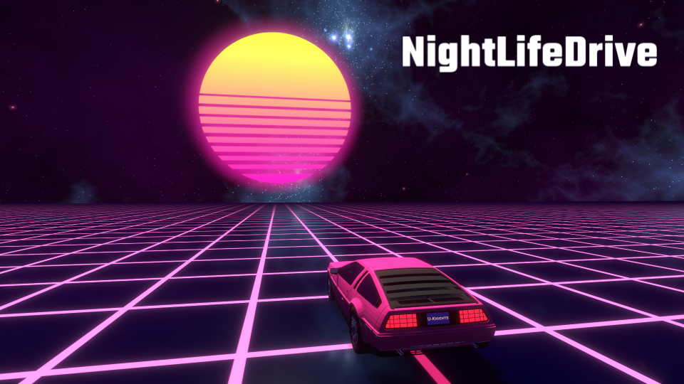
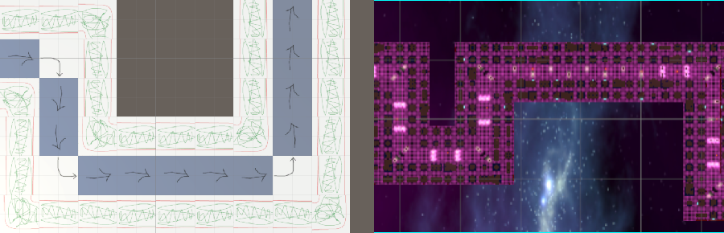
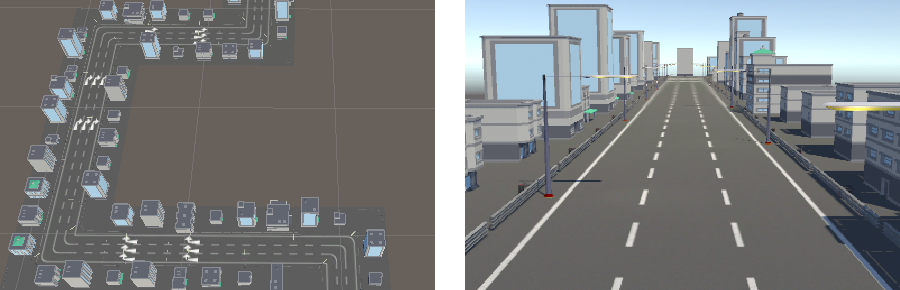
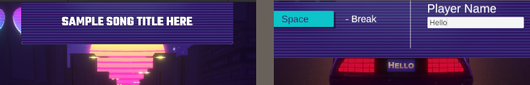
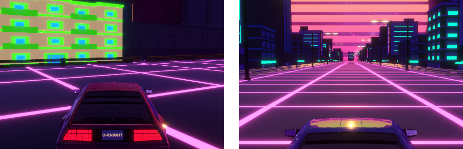

# [NightLifeDrive](https://n-c0de-r.itch.io/nightlife-drive)

Forked from [U-Knights](https://github.com/U-Knights). To play, download the ZIP file from the "Releases" section.

[See here](https://github.com/U-Knights/U-Knights/blob/main/NightLifeDrive.md) for more information in German.

## Idea

The idea was to have a relaxed game without too much of a challenge or competition, just to enjoy the visual style, the snythwave music and the overall 80s vibe.

#

## My Contributions

- ### Endless Random Track Generation

    Inspired by the board game "Carccassone" I made a rather simple track generator, that uses the current angles to determine when and in which direction to turn.
    
    It's simple math with some modulo arithmetic. Each Street tile is rectangular and has specific spawn points, making it fast and effective.
    
    

- ### Object Spawning
    Since everything is based on prefabs, asset collectiosn and ser pieces where to position everything, it was easy to write scripts to add objects to the scene.

    

- ### Score Counter, Song Display, Name Inputs
    Adding a Song Display panel and an option to set a Player Name to show it in the license plate was easy. The UI was already set and I just needed to extend it and some scripts.

    

- ### glowing materials
    Adding glowing materials with the URP wasn't a big challenge, it was just a matter of style which colors to pick. But I just did the implementation.

    

- ### Particle Animations, Bug Fixes & Documentation.
    Other than that, I did a little particle animation when hitting the cones (see in the final result below), took care of bug fixing, documenting and refactoring some of the code.

---

